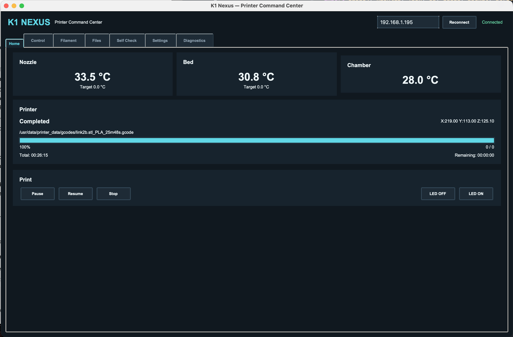
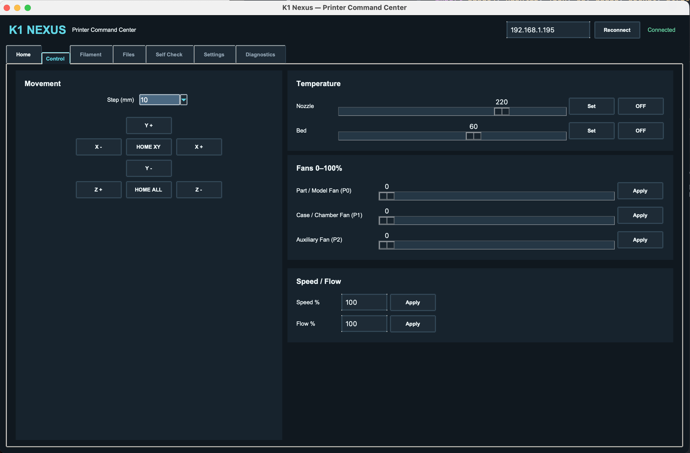
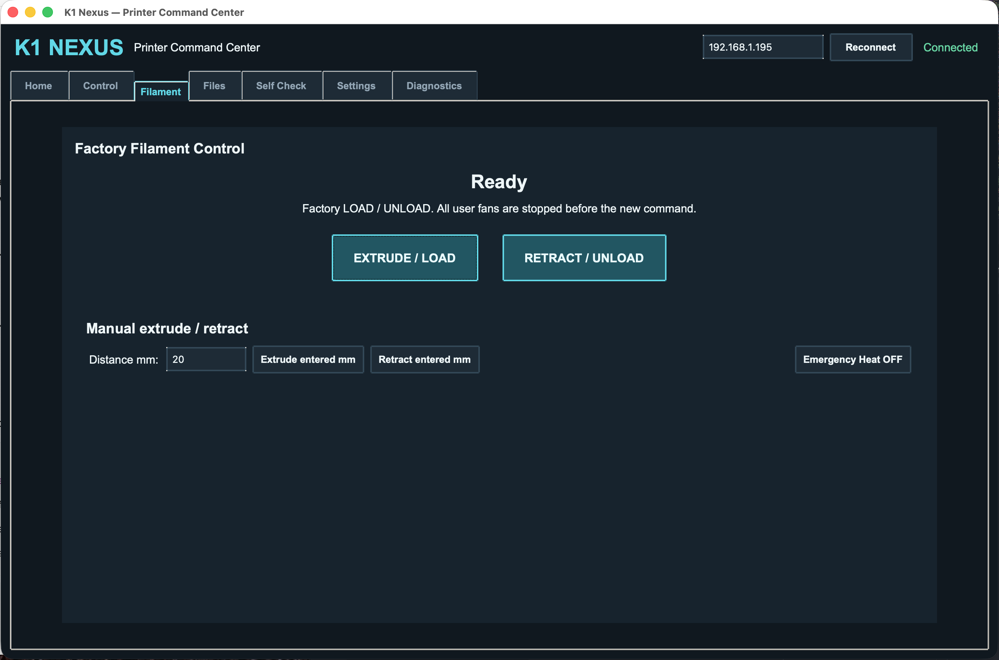

# K1 Nexus - Printer Command Center

K1 Nexus is an unofficial cross-platform desktop application for controlling and monitoring compatible Creality K1-series 3D printers over a local network.

The application provides a desktop interface for printer status, temperature and motion controls, filament operations, G-code file management, self-check functions, settings, and diagnostics.

K1 Nexus is an independent community project and is not affiliated with, endorsed by, or supported by Creality.

## Overview

The main screen provides live information about the connected printer, including nozzle, bed and chamber temperatures, print status, progress, timing information and basic print controls.



## Features

- Connect to a compatible Creality K1-series printer over the local network
- Display printer connection and status information
- Monitor nozzle, bed, and chamber temperatures
- Display print progress
- Display print timing information when provided by the printer
- Pause, resume, and stop print jobs
- Control X, Y, and Z movement
- Home printer axes
- Control nozzle and bed target temperatures
- Control printer fans
- Adjust print speed and flow
- Filament loading and unloading controls
- Manual filament extrusion and retraction
- Browse G-code files exposed by the printer
- Upload G-code files
- Download supported files
- Rename and delete supported files
- Start print jobs from the application
- Run available self-check and calibration functions
- Access printer settings and device information
- Built-in diagnostics
- Send G-code commands from the diagnostics interface
- Dark desktop interface

Camera recording and the experimental 3D model preview are not included in this release.

## Printer Control

The Control section provides direct access to printer movement and operating controls.

It includes X, Y and Z movement, axis homing, nozzle and bed temperature controls, fan control, print speed and flow settings.



## Filament Control

The Filament section provides access to the printer's filament loading and unloading functions.

Manual extrusion and retraction are also available, allowing the user to specify the amount of filament to move.



## G-code File Management

The Files section provides access to G-code files available on the printer.

Files can be viewed and managed directly from K1 Nexus. Supported operations include uploading, downloading, renaming, deleting and starting print jobs.

File information provided by the printer, such as material, nozzle temperature, bed temperature and estimated print time, can also be displayed when available.


## Self Check and Calibration

The Self Check section provides access to available printer calibration and maintenance functions.

Depending on printer and firmware support, these functions include automatic bed leveling, input shaping, bed PID calibration, homing and bed mesh information.


## Printer Settings

The Settings section provides access to printer features and system functions exposed by the printer.

Available controls can include filament detection, timelapse settings, nozzle move snapshot, system restart functions, error clearing and access to the stock LAN interface.

Device information reported by the printer can also be viewed from this section.


## Diagnostics

The Diagnostics section displays communication between K1 Nexus and the connected printer.

It can be used to inspect data received from the printer and commands transmitted by the application. G-code commands can also be sent directly from this interface for testing and troubleshooting.


## Supported Platforms

K1 Nexus is designed to run on:

- macOS
- Windows
- Linux

The application is written in Python and uses Tkinter for its graphical interface.

Printer-side functionality depends on the LAN interfaces exposed by the printer firmware. Some functions may therefore behave differently depending on printer model and firmware version.

## Requirements

- Python 3
- Tkinter
- A compatible Creality K1-series printer
- The computer and printer must be reachable on the same local network

K1 Nexus currently uses Python standard-library modules and does not require additional third-party Python packages.

## Installation

Download or clone the repository.

The application files are located inside the `K1_Nexus` directory.

### macOS

Open:

```text
Run K1 Nexus.command
```

Alternatively, open a terminal inside the `K1_Nexus` directory and run:

```bash
python3 k1_touch.py
```

Depending on macOS security settings and how the repository was downloaded, macOS may require permission before opening the launcher.

### Windows

Make sure Python 3 is installed.

The standard Python installer for Windows normally includes Tkinter. During installation, enabling `Add Python to PATH` is recommended.

Open:

```text
Run K1 Nexus.bat
```

Alternatively, open Command Prompt or PowerShell inside the `K1_Nexus` directory and run:

```text
python k1_touch.py
```

### Linux

Install Python 3 and Tkinter using your distribution's package manager if they are not already installed.

Make the launcher executable:

```bash
chmod +x run_k1_nexus.sh
```

Then run:

```bash
./run_k1_nexus.sh
```

Alternatively:

```bash
python3 k1_touch.py
```

## Connecting to the Printer

1. Connect the computer and printer to the same local network.
2. Start K1 Nexus.
3. Find the IP address assigned to the printer by your network.
4. Enter the printer IP address in the field at the top-right of K1 Nexus.
5. Select `Reconnect`.
6. Wait for the application to report `Connected`.

The IP address shown by default in the application may not match your printer. Always use the address currently assigned to your printer.

## Repository Structure

```text
K1_Nexus/
├── README.md
├── LICENSE
├── assets/
│   ├── home.png
│   ├── control.png
│   ├── filament.png
│   ├── files.png
│   ├── self check.png
│   ├── settings.png
│   └── diagnostics.png
└── K1_Nexus/
    ├── k1_touch.py
    ├── Run K1 Nexus.command
    ├── Run K1 Nexus.bat
    └── run_k1_nexus.sh
```

## Application Files

### `k1_touch.py`

Main K1 Nexus application.

### `Run K1 Nexus.command`

Launcher for macOS.

### `Run K1 Nexus.bat`

Launcher for Windows.

### `run_k1_nexus.sh`

Launcher for Linux.

## Compatibility

K1 Nexus is intended for compatible Creality K1-series printers that expose the required control and status interfaces over the local network.

The desktop application is designed to avoid platform-specific dependencies where possible, but printer functionality is dependent on the interfaces exposed by each firmware version.

Compatibility with every K1-series printer and every firmware revision cannot be guaranteed.

If a feature does not respond as expected, the Diagnostics section can help identify which printer interfaces are available.

## Network Access

K1 Nexus communicates with the printer over the local network.

The application does not configure the printer's Wi-Fi network and does not manage or store printer Wi-Fi profiles.

The printer must already be connected to a network that is reachable from the computer running K1 Nexus.

## Safety

K1 Nexus can send motion, temperature, filament, calibration, system and print-control commands to a connected 3D printer.

Verify commands before using them and follow the normal safety procedures recommended for your printer.

Some operations, including movement, heating, filament operations, calibration and system restart functions, can directly affect the printer.

K1 Nexus should not be considered a replacement for the printer's built-in safety systems.

## Project Status

K1 Nexus is an independent project under active development.

The current release focuses on local printer control, monitoring, file management, filament operations, self-check functions, settings and diagnostics through a cross-platform desktop interface.

Functionality may vary depending on the printer model and firmware version.

Testing, feedback and contributions from users with different Creality K1-series printers are welcome.

## License

K1 Nexus is released under the MIT License.

See the `LICENSE` file for the full license text.
