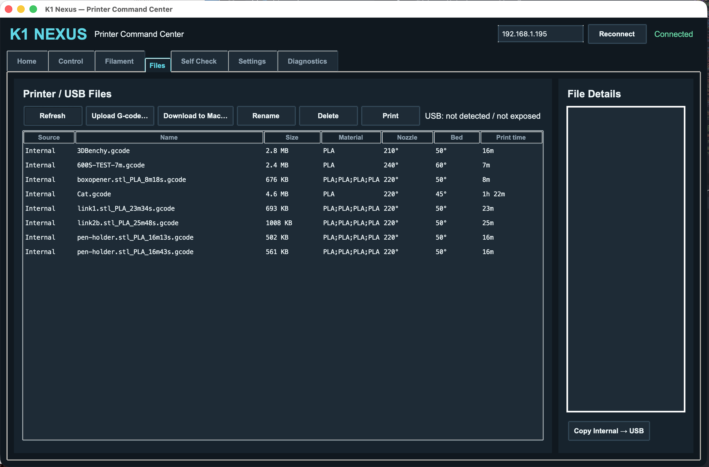
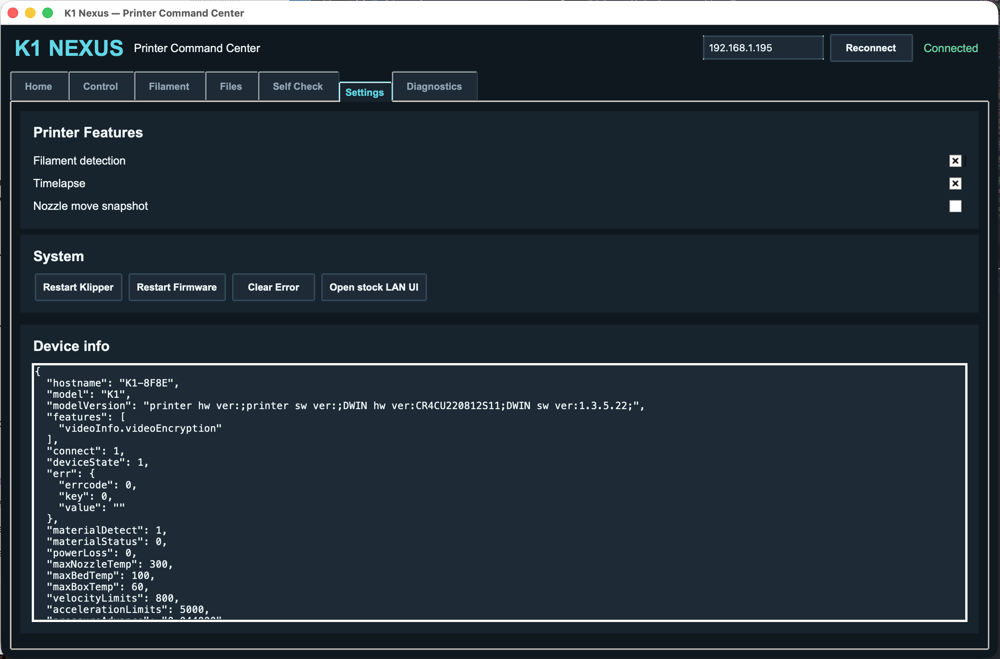
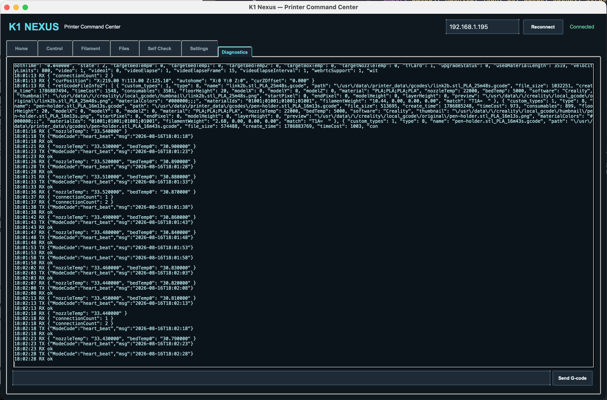

# K1 Nexus - Printer Command Center

K1 Nexus is an unofficial cross-platform desktop application for controlling and monitoring compatible Creality K1-series 3D printers over a local network.

The application provides a desktop interface for printer status, temperature and motion controls, filament operations, G-code file management, self-check functions, settings, and diagnostics.

K1 Nexus is an independent community project and is not affiliated with, endorsed by, or supported by Creality.

## Overview

The main screen provides real-time information about the connected printer, including nozzle, bed, and chamber temperatures, print status, progress, timing information, and basic print controls.


## Features

- Connect to a compatible Creality K1-series printer over the local network
- Display printer connection and status information
- Monitor nozzle, bed, and chamber temperatures
- Display print progress
- Display print timing information when provided by the printer
- Pause, resume, and stop print jobs
- Control X, Y, and Z movement
- Home printer axes
- Control nozzle and bed target temperatures
- Control printer fans
- Adjust print speed and flow
- Filament loading and unloading controls
- Manual filament extrusion and retraction
- Browse G-code files exposed by the printer
- Upload G-code files
- Download supported files
- Rename and delete supported files
- Start print jobs from the application
- Run available self-check and calibration functions
- Access printer settings and device information
- Built-in diagnostics
- Dark desktop interface

Camera recording and the experimental 3D model preview are not included in this release.

## Printer Control

The Control section provides direct access to movement, temperature, fan, speed, and flow controls.

X, Y, and Z axes can be moved using selectable step sizes, while homing controls are available for individual groups of axes. Nozzle and bed target temperatures can also be set directly from the application.


## Filament Control

The Filament section provides controls for loading and unloading filament.

It also includes manual extrusion and retraction controls, allowing a specific filament movement distance to be entered when required.


## G-code File Management

K1 Nexus can access G-code files exposed by the printer and display available file information.

Supported file operations include uploading, downloading, renaming, deleting, and starting print jobs directly from the desktop application.



## Self Check and Calibration

The Self Check section provides access to available printer calibration and maintenance functions.

Depending on the printer and firmware, this can include functions such as Auto Bed Leveling, Input Shaping, Bed PID calibration, bed mesh requests, and printer homing.


## Printer Settings

The Settings section provides access to printer features, system functions, and device information exposed by the printer.

Available options may depend on the connected printer model and firmware version.



## Diagnostics

The Diagnostics section displays communication between K1 Nexus and the connected printer.

It can be used to inspect received printer information, connection activity, responses, and other data useful for testing and troubleshooting.

The interface also provides a field for manually sending G-code commands when required.



## Supported Platforms

K1 Nexus is designed to run on:

- macOS
- Windows
- Linux

The application is written in Python and uses Tkinter for its graphical interface.

Printer-side functionality depends on the LAN interfaces exposed by the printer firmware. Some functions may therefore behave differently depending on printer model and firmware version.

## Requirements

- Python 3
- Tkinter
- A compatible Creality K1-series printer
- The computer and printer must be reachable on the same local network

K1 Nexus currently uses Python standard-library modules and does not require additional third-party Python packages.

## Installation

Download or clone the repository.

The application files are located inside the `K1_Nexus` directory.

### macOS

Open:

```text
Run K1 Nexus.command
```

Alternatively, open a terminal inside the `K1_Nexus` directory and run:

```bash
python3 k1_touch.py
```

Depending on macOS security settings and how the repository was downloaded, macOS may require permission before opening the launcher.

### Windows

Make sure Python 3 is installed.

The standard Python installer for Windows normally includes Tkinter. During installation, enabling `Add Python to PATH` is recommended.

Open:

```text
Run K1 Nexus.bat
```

Alternatively, open Command Prompt or PowerShell inside the `K1_Nexus` directory and run:

```text
python k1_touch.py
```

### Linux

Install Python 3 and Tkinter using your distribution's package manager if they are not already installed.

Make the launcher executable:

```bash
chmod +x run_k1_nexus.sh
```

Then run:

```bash
./run_k1_nexus.sh
```

Alternatively:

```bash
python3 k1_touch.py
```

## Connecting to the Printer

1. Connect the computer and printer to the same local network.
2. Start K1 Nexus.
3. Find the IP address assigned to the printer by your network.
4. Enter the printer IP address in the field at the top-right of K1 Nexus.
5. Select `Reconnect`.
6. Wait for the application to report `Connected`.

The IP address shown by default in the application may not match your printer. Always use the address currently assigned to your printer.

## Repository Structure

```text
K1_Nexus/
├── README.md
├── LICENSE
├── assets/
│   └── screenshots/
│       ├── control.png
│       ├── diagnostics.png
│       ├── filament.png
│       ├── files.png
│       ├── home.png
│       ├── self check.png
│       └── settings.png
└── K1_Nexus/
    ├── k1_touch.py
    ├── Run K1 Nexus.command
    ├── Run K1 Nexus.bat
    └── run_k1_nexus.sh
```

## Application Files

### `k1_touch.py`

Main K1 Nexus application.

### `Run K1 Nexus.command`

Launcher for macOS.

### `Run K1 Nexus.bat`

Launcher for Windows.

### `run_k1_nexus.sh`

Launcher for Linux.

## Compatibility

K1 Nexus is intended for compatible Creality K1-series printers that expose the required control and status interfaces over the local network.

The desktop application is designed to avoid platform-specific dependencies where possible, but printer functionality is dependent on the interfaces exposed by each firmware version.

Compatibility with every K1-series printer and every firmware revision cannot be guaranteed.

If a feature does not respond as expected, the Diagnostics section can help identify which printer interfaces are available.

## Network Access

K1 Nexus communicates with the printer over the local network.

The application does not configure the printer's Wi-Fi network and does not manage or store printer Wi-Fi profiles.

The printer must already be connected to a network that is reachable from the computer running K1 Nexus.

## Safety

K1 Nexus can send motion, temperature, filament, calibration, system, and print-control commands to a connected 3D printer.

Verify commands before using them and follow the normal safety procedures recommended for your printer.

K1 Nexus should not be considered a replacement for the printer's built-in safety systems.

## Project Status

K1 Nexus is an independent project under active development.

The current release focuses on local printer control, monitoring, file management, filament operations, self-check functions, settings, and diagnostics through a cross-platform desktop interface.

Testing has primarily been performed with the hardware and firmware available during development. Feedback from users with other compatible K1-series printers and firmware versions is welcome.

## Contributing

Bug reports, compatibility information, suggestions, and contributions are welcome.

When reporting an issue, include the printer model and firmware version when possible. Diagnostic information can also help identify differences between printer firmware versions.

## License

K1 Nexus is released under the MIT License.

See the `LICENSE` file for the full license text.

## Disclaimer

K1 Nexus is an independent, unofficial project.

Creality and Creality K1 are trademarks of their respective owners. This project is not affiliated with, endorsed by, or supported by Creality.
